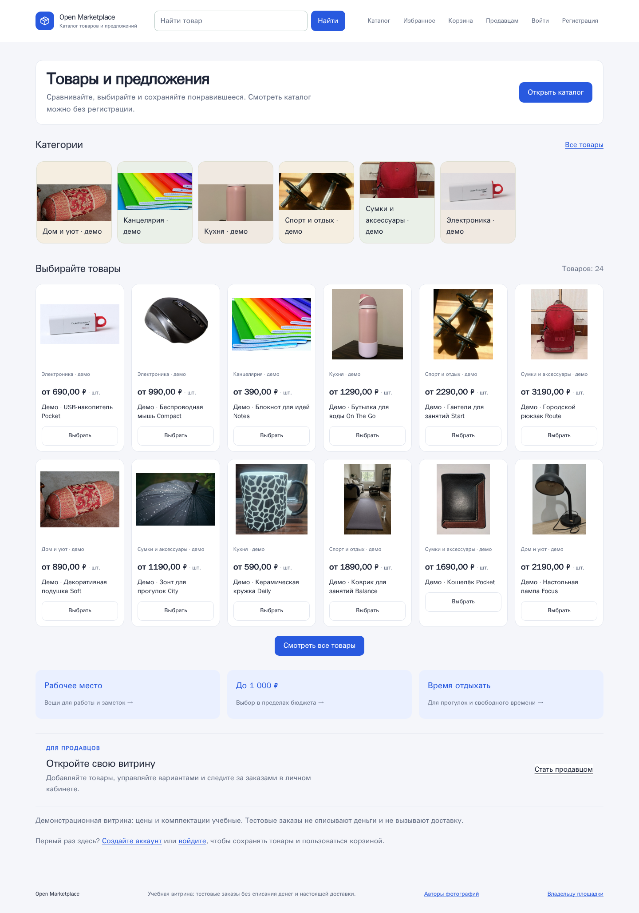

# Open Marketplace — открытая витрина и демонстрационная корзина

Русский перевод | [English — основной README](README.md)

**Проверенный выпуск:** [v0.4.0](https://github.com/VibeSan7/Open_Marketplace/releases/tag/v0.4.0) · [Скачать ZIP](https://github.com/VibeSan7/Open_Marketplace/releases/download/v0.4.0/open-marketplace-0.4.0-source.zip) · [Контрольная сумма](https://github.com/VibeSan7/Open_Marketplace/releases/download/v0.4.0/SHA256SUMS)

**Проверка v0.4.0:** 647 тестов и 12 правил границ модулей прошли. Проверены установка, восстановление, мобильная и настольная витрина. [Итоговый отчёт и ссылки на проверки GitHub](docs/releases/v0.4.0-verification.md).

[Текущая ветка main](https://github.com/VibeSan7/Open_Marketplace/archive/refs/heads/main.zip) может содержать более новые изменения, чем неизменяемый архив выпуска. [Что изменилось в v0.4.0](docs/releases/v0.4.0.md) · [Предыдущие выпуски](https://github.com/VibeSan7/Open_Marketplace/releases).

Проект запускается на вашем компьютере через Docker и открывается в браузере. Продавец ведёт карточки, фотографии, варианты, цены и остатки. Покупатель ищет товары и сравнивает подтверждённые предложения продавцов.

**Открытая витрина с отдельно включаемой демонстрацией корзины и заказа — без настоящих платежей.** Цифровые товары пока можно сохранять только в непубличных черновиках. Локальный запуск не публикует сайт в интернете.

Публичные товары, поиск, фотографии и страницы продавцов доступны гостям. Старые карточки после обновления остаются закрытыми: владелец явно включает публичный показ опубликованного товара. Для избранного и демонстрационных заказов нужен активный личный аккаунт с подтверждённой почтой; допуск к закрытому каталогу и управление товарами остаются отдельными правами.



На снимке — учебные данные. Новая установка пуста, но [отдельная команда](docs/runbooks/storefront-demo-en.md) добавляет 24 товара с фотографиями, 48 вариантов, 6 категорий и 3 вымышленных магазина. Готовых паролей нет. [Авторы фотографий и лицензии](docs/demo-image-credits.md).

## Что работает

- Регистрация, подтверждение почты, вход, двухэтапная защита, управление сессиями и роли сотрудников.
- Открытая гостевая витрина, отдельный допуск к закрытым товарам и проверка продавцов.
- Черновики карточек: изменения содержания становятся видны только после публикации. Цена и остаток сохраняются отдельно, без потери более новых изменений.
- Варианты товара, фотографии, места хранения, штуки / килограммы / метры, цены в рублях, бесплатные товары.
- Общие карточки и сравнение идентичных предложений после подтверждения сотрудником.
- Поиск по словам, опечаткам и смыслу, диапазон цены и сортировка, фильтры, автоматическая подгрузка и ссылки с сохранёнными условиями.
- Избранное, страницы продавцов, понятные состояния карточек и закрытый предпросмотр перед публикацией.
- [Демонстрация заказа](docs/runbooks/demo-orders-en.md): корзина нескольких продавцов, количество и итог, подтверждение изменения цены, защита от повторного оформления, тестовая оплата, передача, получение и отмена. Выключена по умолчанию; настоящих денег и отправлений нет.
- Локальная commerce-основа сохраняет резервы, неизменяемые оплаченные снимки заказов, платёжный ledger, ожидающие планы физической отгрузки отдельно для каждого продавца и локальный seller-arranged lifecycle до подтверждения получения покупателем. Запросов к платёжным и транспортным провайдерам она не делает.
- Фотографии и база сохраняются в отдельных постоянных хранилищах Docker. Частные фотографии не раздаются как общедоступные файлы.

## 1. Что установить

- [Docker Desktop](https://www.docker.com/products/docker-desktop/) с поддержкой Linux-контейнеров. Запустите Docker Desktop перед дальнейшими командами.
- [Git for Windows](https://git-scm.com/downloads/win): команды ниже выполняются в **Git Bash**, не в PowerShell. На Linux/macOS подходит обычный Bash.
- [Python 3](https://www.python.org/downloads/) для однократного создания файла настроек. Само приложение, его библиотеки и тесты работают внутри Docker.

Первый запуск скачивает образы и локальную модель поиска. Нужны интернет и свободное место для Docker; повторный запуск уже использует сохранённые данные. Для проверок используйте современный Docker Compose, поддерживающий `!reset` (2.24.4 или новее).

## 2. Скачать проект

Для проверенной версии скачайте [ZIP v0.4.0](https://github.com/VibeSan7/Open_Marketplace/releases/download/v0.4.0/open-marketplace-0.4.0-source.zip) и распакуйте архив. Его контрольная сумма опубликована в [SHA256SUMS](https://github.com/VibeSan7/Open_Marketplace/releases/download/v0.4.0/SHA256SUMS). Для текущей ветки разработки клонируйте репозиторий:

```bash
git clone https://github.com/VibeSan7/Open_Marketplace.git
```

```bash
cd Open_Marketplace
```

Если скачали ZIP, перейдите в распакованную папку, где лежит `compose.yaml`. Команды выполняются именно из неё. Доступ к коду не предоставляет доступ к чужим установкам: учётные записи и права вы настраиваете в своей копии.

## 3. Создать настройки — только при первом запуске

Для последовательного первого запуска используйте [инструкцию установки на английском](docs/runbooks/initial-setup-en.md). Она ссылается на эту процедуру и не предлагает заменять настройки уже работающей копии.

Следующая команда создаёт `.env` с новыми случайными ключами и паролем базы. Значения не выводятся. **Существующий `.env` не перезаписывается. Не удаляйте его и не создавайте заново для уже работающей базы.**

```bash
python - <<'PY'
import base64
import os
import secrets
from pathlib import Path

keys = {
    "DJANGO_SECRET_KEY": secrets.token_urlsafe(48),
    "DATABASE_PASSWORD": secrets.token_urlsafe(32),
    "TOTP_ENCRYPTION_KEY": base64.urlsafe_b64encode(secrets.token_bytes(32)).decode("ascii"),
    "OUTBOX_ENCRYPTION_KEY": base64.urlsafe_b64encode(secrets.token_bytes(32)).decode("ascii"),
    "LINK_EXCHANGE_ENCRYPTION_KEY": base64.urlsafe_b64encode(secrets.token_bytes(32)).decode("ascii"),
    "THROTTLE_HASH_KEY": base64.urlsafe_b64encode(secrets.token_bytes(32)).decode("ascii"),
}
source = Path(".env.example").read_text(encoding="utf-8").splitlines()
rendered = []
for line in source:
    name, separator, _ = line.partition("=")
    rendered.append(f"{name}={keys[name]}" if separator and name in keys else line)
descriptor = os.open(".env", os.O_WRONLY | os.O_CREAT | os.O_EXCL, 0o600)
with os.fdopen(descriptor, "w", encoding="utf-8", newline="\n") as output:
    output.write("\n".join(rendered) + "\n")
PY
```

`.env` исключён из Git и Docker-образа. Не отправляйте его в чат, GitHub или журнал ошибок. Если получена ошибка `FileExistsError`, файл уже существует: сохраните его и продолжите, а не удаляйте ключи.

## 4. Запустить

Создать и обновить таблицы базы:

```bash
docker compose run --rm --build web python manage.py migrate --noinput
```

Однократно скачать и проверить локальную модель смыслового поиска:

```bash
docker compose run --rm web python manage.py prepare_catalog_search
```

Запустить приложение и доставку писем в фоне:

```bash
docker compose up --build -d
```

Проверить состояние:

```bash
docker compose ps
```

Откройте:

- **Сайт и начало работы:** <http://127.0.0.1:8000/>
- **Местная почта:** <http://127.0.0.1:8025/> — здесь письма регистрации и приглашения. Это Mailpit: почтовый ящик для локальной установки, не настоящая отправка на внешний email.
- **Панель сотрудников:** <http://127.0.0.1:8000/admin/>

На новой установке нет готовых товаров и паролей. Для быстрого знакомства используйте [демонстрационное наполнение](docs/runbooks/storefront-demo-en.md). Для собственных товаров настройте администратора и продавца по следующему разделу.

## 5. Настроить администратора и добавить первый товар

[Пошаговая инструкция для владельца, продавца и покупателя](docs/runbooks/catalog-quickstart-en.md).

После запуска откройте в своей копии [встроенную read-only инструкцию](http://127.0.0.1:8000/setup/). Она объясняет роли, Mailpit и явный допуск; сама страница ничего не создаёт.

Коротко:

1. Создайте первого администратора командой ниже. Адрес `admin@example.test` предназначен для локальной демонстрации: письмо придёт в Mailpit.
2. Откройте приглашение в Mailpit, задайте пароль и настройте приложение-аутентификатор. Оно генерирует одноразовый код для второго шага входа. Резервные коды сохраните отдельно, не в репозитории.
3. Создайте сотрудника с ролью проверки продавцов. Затем зарегистрируйте отдельный личный аккаунт продавца: служебный аккаунт не используется для торговли.
4. Продавец подтверждает почту, включает двухэтапную защиту, отправляет заявку. Сотрудник проверяет и одобряет её.
5. Администратор открывает `/catalog/manage/`, разрешает участие по email и создаёт категорию с характеристиками.
6. Продавец открывает «Мои карточки», создаёт карточку, добавляет варианты, настоящие фотографии, цену и остаток, затем нажимает «Опубликовать». Для гостевого просмотра отдельно выбирает «Открыть публичный показ»; его отключение снова закрывает карточку для гостей.

```bash
docker compose run --rm web python manage.py bootstrap_security_admin --email admin@example.test
```

Повторное создание первого администратора не предусмотрено. Не сбрасывайте базу ради повторного приглашения. Если приглашение истекло или письмо не приходит, используйте [инструкцию диагностики](docs/runbooks/local-development.md).

## Остановить и снова запустить

Обычная остановка **сохраняет базу, фотографии и модель**:

```bash
docker compose down
```

Повторный запуск:

```bash
docker compose up -d
```

**Не добавляйте `-v` к остановке:** этот флаг удаляет постоянные хранилища вместе с данными. Перед обновлением сохраняйте `.env`, базу и фотографии — [обновление и резервная копия](docs/runbooks/catalog-quickstart-en.md#backups-and-updates).

## Автоматическая проверка

Тесты работают в отдельной временной базе и отдельном проекте Docker. Не направляйте их на рабочую установку: проверка доставки писем очищает тестовый Mailpit.

Сборка тестовой среды включает настоящий браузер Chromium:

```bash
docker compose -p open-marketplace-tests -f compose.yaml -f compose.test.yaml build test
```

```bash
docker compose -p open-marketplace-tests -f compose.yaml -f compose.test.yaml run --rm test python manage.py prepare_catalog_search
```

```bash
docker compose -p open-marketplace-tests -f compose.yaml -f compose.test.yaml run --rm test python manage.py test open_marketplace --noinput --verbosity 1
```

```bash
docker compose -p open-marketplace-tests -f compose.yaml -f compose.test.yaml run --rm test lint-imports --no-cache
```

```bash
docker compose -p open-marketplace-tests -f compose.yaml -f compose.test.yaml run --rm test python manage.py makemigrations --check --dry-run
```

Восстановление контрольной базы проверяется отдельно; рабочая база в нём не участвует:

```bash
COMPOSE_PROJECT_NAME=open-marketplace-tests bash ops/verify_restore.sh
```

Результаты проверки v0.4.0, ограничения и ссылки на проверки GitHub: [итоговый отчёт](docs/releases/v0.4.0-verification.md). [Предыдущий отчёт каталога](docs/security/phase-2-local-validation.md) сохранён для истории. Тесты не являются обещанием безошибочности любой установки или заменой настройки внешнего сервера.

## Ограничения

- По умолчанию сайт доступен только на этом компьютере. Внешний сервер, домен, HTTPS, настоящая доставка email и эксплуатационное резервирование в этот выпуск не входят. Встроенный локальный сервер Django не предназначен для открытого интернет-сервиса.
- Гости видят только явно открытые карточки. Приватные товары остаются под допуском; проверка продавцов, управление каталогом и служебные полномочия не выдаются регистрацией.
- Для локального HTTP предусмотрены обычные cookies. Настройки защищённого HTTPS-режима существуют, но не включайте их без настроенного HTTPS: браузер не сможет войти по обычному HTTP.
- Приблизительный поиск действительно использует локальную многоязычную модель, но может ошибаться в релевантности. Он не объединяет товары автоматически и не ослабляет фильтры, остатки или права.
- Подтверждение загрузчиком подлинности фотографии не является автоматической проверкой её происхождения.
- Нет настоящей покупки через платёжного провайдера, расчёта доставки или выдачи цифровых файлов. Локальная commerce-основа сохраняет реальные резервы PostgreSQL, неизменяемые заказы и платёжный ledger, но не выполняет запросы к провайдерам. Демонстрационный checkout остаётся отдельным; банковские карты и платёжные сервисы не подключены.

## Документы и модули

- [Требования к витрине и корзине v0.4](docs/superpowers/specs/2026-09-16-storefront-v04-design.md).
- [Итоговая проверка v0.4.0](docs/releases/v0.4.0-verification.md).
- [Согласованные правила каталога](docs/superpowers/specs/2026-09-14-phase-2-catalog-design.md).
- [План реализации](docs/superpowers/plans/2026-09-15-phase-2-catalog-implementation.md).
- [Завершённая первая фаза: вход и права](docs/security/phase-1-review.md).
- [Статус использования кода и лицензии](docs/code-use-status.md).

Предметные модули `identity`, `access`, `seller_onboarding`, `catalog`, `commerce`, `audit` и `outbox` взаимодействуют через `public.py`. `web` и `staff_admin` отвечают за страницы, `verification` — за проверку восстановления и отдельное учебное наполнение.
